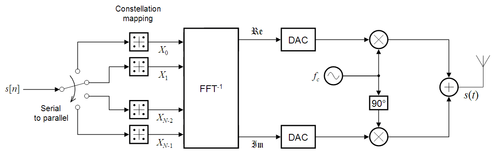

# **OFDM** 

### ¿Qué es?
OFDM (Multiplexación por División de Frecuencia Ortogonal) es un método de modulación multiportadora digital para transmisión de símbolos. Divide un canal de alta velocidad en múltiples subportadoras de baja velocidad. Estas subportadoras están matemáticamente diseñadas para ser ortogonales, lo que permite que sus espectros se solapen sin interferirse mutuamente, transmitiendo datos en paralelo, mejorando la eficiencia espectral. 

Básicamente, en lugar de enviar los datos en una sola portadora, OFDM divide la señal en muchas señales más pequeñas y las transmite simultáneamente, permitiendo mayor resistencia a la interferencia y a la dispersión en el canal.

Uno de los elementos clave de la implementación de OFDM es el uso de la transformada rápida de Fourier (FFT) y su inversa (IFFT), que permiten una conversión eficaz de la señal entre los dominios de la frecuencia y el tiempo.

### ¿En qué se usa OFDM?
Se utiliza en los sistemas modernos de comunicaciones digitales de banda ancha, especialmente en entornos con multipropagación. Por ejemplo en comunicaciones WiFi, Redes celulares 4G y 5G, Televisión digital terrestre, etc.

---

# Transmisor OFDM

La información que se quiere transmitir es una secuencia binaria.
La agrupación de estos binarios forman símbolos, que luego son modulados digitalmente, por ejemplo en modulación **QPSK, QAM16, QAM64, etc**.
Al usar esta modulación los símbolos quedan mapeados como números complejos, obteniendo así una secuencia de **símbolos complejos**.

## Símbolos Complejos
Los símbolos complejos resultantes se asignan a las distintas subportadoras en el dominio de la frecuencia. La **IFFT** permite transformar esta representación en frecuencia al dominio temporal para su transmisión física. 
<!--Falta Símbolos OFDM y Fc antes de pasar al dominio temporal-->

## Señal OFDM en tiempo discreto
Para transmitir los símbolos en paralelo sobre múltiples subportadoras ortogonales, la IFFT genera en el dominio temporal la combinación lineal de exponenciales complejas ortogonales.
Para implementarlo, se generan $N$ muestras discretas que constituyen un símbolo OFDM en el dominio temporal.
Podemos definir $T$ como el periodo de cada símbolo OFDM y $T_s$ como el periodo de muestreo $(T_s=T/N)$.
Con un paso de $t=nT_s$ ($t=nT/N$), la señal OFDM se determina como:

$$
x[n] = \sum_{k=0}^{N-1} X[k] \, e^{j 2\pi \frac{kn}{N}}
$$

Para $n=0,1,2,...,N-1$

Donde:
- $X[k]$ son los símbolos complejos asignados a cada subportadora.
- Cada término exponencial representa una subportadora ortogonal.
- Cada muestra $x[n]$ es una combinación de todas las subportadoras.
- El bloque completo de $N$ muestras forma un **símbolo OFDM**

## Garantía de Ortogonalidad
Si definimos dos vectores complejos $\phi_k$ y $\phi_m$, la ortogonalidad se da cuando al calcular el producto interno entre ellos es igual a 0,  $\langle \phi_k , \phi_m\rangle = 0$.

Por lo tanto cada subportadora es ortogonal entre si, si se cumple que para:

$$
\langle \phi_k[n] , \phi_m[n]\rangle = \sum_{n=0}^{N-1} e^{j 2\pi \frac{kn}{N}}.e^{-j 2\pi \frac{mn}{N}}= \sum_{n=0}^{N-1}e^{j 2\pi (k-m)\frac{n}{N}} = \ 0 \ para \ k \neq m.
$$

Si definimos $r=e^{j 2\pi \frac{(k-m)}{N}}$, y reemplazamos en la sumatoria, obtenemos una serie geométrica compleja $S$.
$$
S = \sum_{n=0}^{N-1}r^n = \frac{1-r^N }{1-r} \ si \ r \neq 1
$$
Para cumplir con la condición de que $\langle \phi_k[n] , \phi_m[n]\rangle = 0$, $\ r^N$ debe ser 1.
$$
r^N = (e^{j 2\pi \frac{(k-m)}{N}})^N = e^{j 2\pi(k-m)}
$$
Como $k$ y $m$ son números enteros $\to \ e^{j 2\pi(k-m)} = 1$.

<!----De más?---->
La ortogonalidad entre subportadoras se garantiza cuando el espaciamiento en frecuencia cumple $\Delta f=1/T$.

---
Incluir video de valencia
El prefijo cíclico es para los símbolos OFDM, no para cada símbolo QAM
---
## Prefijo Cíclico  
En un canal con múltiple trayecto, la señal transmitida sufre retardos debido a reflexiones.
Esto produce interferencia entre símbolos OFDM consecutivos (ISI) y puede romper la ortogonalidad entre subportadoras.
Para evitar este problema, se inserta un prefijo cíclico (CP), que consiste en copiar las últimas muestras del símbolo OFDM y añadirlos al inicio del mismo.

#### ¿Cómo determino la cantidad de muestras para el $CP$?
La longitud del CP debe compensar el máximo retardo entre el camino directo y el camino más tardío.
Esto es la **dispersión del canal**.
En el dominio del tiempo la señal recibida es la convolución del símbolo transmitido y la respuesta al impulso del canal.
$$
r[n] = x[n]*h[n]
$$
La dispersión del canal es la longitud de $h[n] \ (L_h)$, y la longitud de $r[n]$ es $N+L_h-1$.

Por lo tanto la longitud de $CP$ tiene que ser:
$$
L_{CP} \geq L_h-1
$$ 
Para no romper la ortogonalidad de las subportadoras y no que no haya ISI.
<!---->
Para señales como WiFi, LTE, Televisión digital, el $CP$ esta estandarizado.

---
## Transmisión por antena
Una vez obtenido el símbolo OFDM $x[n]$, la señal en tiempo discreto pasa por un conversor digital-analógico (DAC) para transformarse en una señal analógica continua $x(t)$.

Como $x[n]$ es una banda base compleja discreta, $x(t)$ resulta una banda base compleja continua, y se modula a una frecuencia de carry $f_c$ de alta frecuencia, produciendo un corrimiento espectral, para luego transmitir por antena.

#### Señal Resultante
Si $x(t) = I(t)+jQ(t)$, la portadora es $e^{j 2\pi f_c t}$, la señal resultante es: 
$
s(t)= \real \{ x(t).e^{j 2\pi f_c t} \}
$

Reemplazando: 
$$
s(t)= I(t)cos(2\pi f_c t)-Q(t)sen(2\pi f_c t)
$$

---

$$
s(t) = \sum_{k=0}^{N-1} X[k] \, e^{j 2\pi f[k] t}, \quad 0 \le t < T
$$

Donde:
- $X[k]$ = símbolo complejo en la subportadora $k$
- $f[k]$ = frecuencia de la subportadora
- $N$ = número total de subportadoras
- $T$ = duración del símbolo OFDM
- Cada término exponencial representa una subportadora ortogonal

.....................................

---
https://www.tme.com/mx/es/news/library-articles/glossary/page/69328/ofdm-multiplexacion-por-division-de-frecuencias-ortogonales-definicion/

1/N --> escala la potencia 

## ¿Cómo es matemáticamente?

Matemáticamente, la señal OFDM en el dominio temporal es: 

$$
s(t) = \sum_{k=0}^{N-1} X_k \, e^{j 2\pi f_k t}, \quad 0 \le t < T
$$

Donde:
- $𝑋_𝑘$ = símbolo complejo en la subportadora $k$
- $𝑓_𝑘$ = frecuencia de la subportadora
- $N$ = número total de subportadoras
- $T$ = duración del símbolo OFDM

### ¿Cómo garantizamos ortogonalidad?

Para garantizar ortogonalidad $𝑓_𝑘$ es equivalente a $k.\Delta f$, donde $\Delta f=1/T$. Entonces:

$$
s(t) = \sum_{k=0}^{N-1} X_k \, e^{j 2\pi k \frac{t}{T}}
$$

¿a que se refiere con que sea de alta y baja velocidad?
¿Para qué sirve? ¿Qué ventaja tiene al usarla?
¿Qué representa la fórmula matemática?
¿Qué decía evangelista sobre la OFDM? 

https://es.wikipedia.org/wiki/Diagrama_de_constelaci%C3%B3n --> explicación para la constelación

### Obtención de $h[n]$
Otro problema al recibir es la adición de adición de $h[n]$ a la señal transmitida.
En el dominio de la frecuencia la convolución se transforma en el producto de la señales. 
Para saber como es $h[n]$ se envían símbolos conocidos y se puede calcular.
Una vez sabiendo $h[n]$ se conoce su longitud $L_h$ y a la recepción de símbolos se la multiplica por su inversa $h^{-1}[n]$ para limpiar el símbolo.
