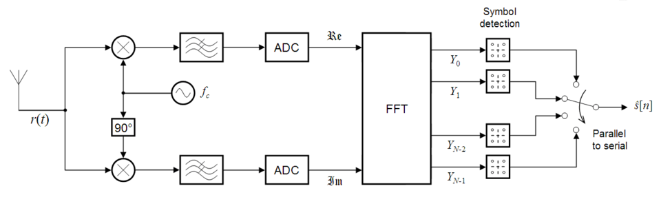

# Receptor OFDM

El objetivo es recuperar la secuencia de bits transmitida a partir de la señal OFDM recibida.

En un sistema real, la señal analógica recibida por la antena se demodula a una frecuencia de portadora $f_c$ y pasa por un conversor analógico-digital (ADC), que realiza el muestreo y cuantización de la señal para obtener una representación digital de la misma. Esta señal digital es la que posteriormente puede ser procesada por el receptor OFDM.

---

## Señal recibida

Se considera una transmisión en **banda base** y un **canal ideal**, por lo tanto no hay ruido, desvanecimiento, interferencia ni distorsión del canal. Por lo tanto, podemos considerar:

$$
r[n] = x[n]
$$

donde:

* $x[n]$ es la señal OFDM transmitida.
* $r[n]$ es la señal OFDM recibida.
* $n=0,1,...,N-1$ representa las muestras del símbolo OFDM.

---

## Eliminación del Prefijo Cíclico

Antes de aplicar la DFT es necesario eliminar el prefijo cíclico agregado en el transmisor.

Si el símbolo OFDM tiene $N$ muestras y el prefijo cíclico tiene una longitud $L_{CP}$, la señal recibida tendrá $N+L_{CP}$ muestras.

El receptor elimina las primeras $L_{CP}$ muestras, conservando únicamente las $N$ muestras correspondientes al símbolo OFDM original.

A partir de este punto, $r[n]$ representa las $N$ muestras del símbolo OFDM recibidas una vez eliminado el prefijo cíclico.

---

## Transformación al dominio de la frecuencia

Ya con las $N$ muestras del símbolo OFDM disponibles, para recuperar los símbolos complejos que fueron asignados a las subportadoras, se aplica la DFT.

La DFT de la señal recibida se define como:

$$
Y[k] = \sum_{n=0}^{N-1} r[n] e^{-j2\pi\frac{kn}{N}}
$$

Para: $k=0,1,...,N-1$

La DFT permite transformar nuevamente la representación de la señal desde el dominio temporal hacia el dominio de la frecuencia.

Debido a que es un canal ideal, y considerando que la DFT y la IDFT son operaciones inversas entre sí, se obtiene:

$$
Y[k] = X[k]
$$

Por lo tanto, los símbolos complejos recuperados en cada subportadora son exactamente iguales a los símbolos transmitidos.

---

## Demodulación

Los símbolos complejos recuperados mediante la DFT deben ser demodulados para obtener nuevamente la secuencia de bits original.

La demodulación realiza el proceso inverso al mapeo realizado en el transmisor.

En QPSK los símbolos recibidos se encuentran en cuatro posibles posiciones del plano complejo:

$$
X[k] \in
\left\{
\frac{1+j}{\sqrt{2}},
\frac{-1+j}{\sqrt{2}},
\frac{-1-j}{\sqrt{2}},
\frac{1-j}{\sqrt{2}}
\right\}
$$

Cada posición representa una combinación diferente de dos bits.

El demodulador determina a qué símbolo de la constelación pertenece cada valor complejo recibido y asigna nuevamente la combinación de bits correspondiente.

En QAM16 el procedimiento es equivalente, pero se dispone de 16 posibles símbolos, por lo que cada símbolo representa 4 bits.

Finalmente, los grupos de bits obtenidos de cada símbolo se concatenan para formar nuevamente la secuencia de bits transmitida.

---
